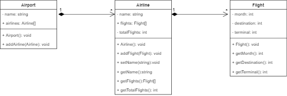

# Analizador del AICM :airplane:
Este programa genera aleatoriamente vuelos, simulando el flujo del Aeropuerto Internacional de la Ciudad de México. 
Posteriormente, realiza análisis de los vuelos y las aerolíneas que salen de éste. 
El programa responde lo siguiente: 
- ¿Cuántos vuelos registrados tienen las aerolíneas que están en el aeropuerto?
- ¿Cuántos vuelos de salida hay por mes?
- ¿Cuántos vuelos de salida hay por destino?
- ¿De qué terminal salen más vuelos? 


## Instalación

Ir al directorio donde quiera tener guardado el programa y clone el repositorio con git. 

```bash
git clone https://github.com/louloubadillo/OOP_TC1033.git
```
En el directorio donde se encuentra el repositorio, ir a la carpeta Proyecto_Final 
```bash
cd Proyecto_Final
```
Compilar el archivo y generar un ejecutable
```bash
g++ -o aero.exe main.cpp -std=c++14
```
Correr main
```bash
./main 
```
## Diagrama UML

Este es el diagrama UML: 



## Pruebas
- La suma total de los vuelos es la misma para todos los contadores. (por mes, por destino, por terminal)
- Los números se generan aleatoriamente y cambian cada que se agrega un vuelo. 
- Los vuelos sí se están agregando a las aerolíneas. (Se pueden ver con .getFlights())
- La cantidad de vuelos mostrada en los contadores por aerolínea coincide con airline.getTotalFlights()


